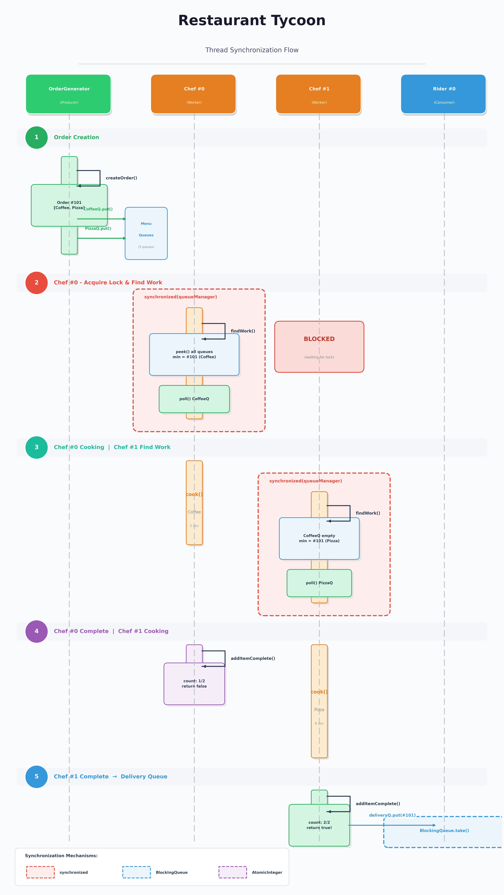

# 👨🏻‍🍳 미니 식당 타이쿤 (Mini Restaurant Tycoon)

자바 멀티스레딩 환경에서 생산자-소비자(Producer-Consumer) 패턴을 구현한 식당 운영 시뮬레이션 프로젝트입니다.

## 🎮 실행 화면


## 1. 프로젝트 개요

여러 개의 요리사(Chef)와 배달원(Rider) 스레드가 공유 자원인 주문 큐를 통해 데이터를 처리하는 시스템입니다. <br/>
고객의 주문(`Order`)은 여러 개의 메뉴(ex. 커피, 피자, 파스타)로 구성됩니다. 각 메뉴는 독립적인 메뉴별 큐로 분산 저장되어 요리사들의 작업 대기열이 됩니다. <br/>
요리사 스레드(`ChefWorker`)는 메뉴 큐에서 각자 일감을 가져와 병렬로 조리를 수행합니다. 모든 메뉴가 완성되면 주문은 배달 큐로 넘어갑니다. 이후 배달원 스레드(`RiderWorker`)는 배달 큐에 쌓인 완성된 주문을 가져가 고객에게 전달합니다.

## 2. 기술 스택 및 아키텍처

- Language: Java 17
- Logging: SLF4J, Logback

```text
src/main/java/com/tycoon/
├── Main.java                 # Entry Point: 인자 처리 및 시스템 가동
├── core/                     
│   ├── Kitchen.java          # 요리사 관리 및 메뉴별 큐 소유
│   ├── DeliveryCenter.java   # 배달원 관리 및 배달 큐 소유
│   ├── OrderGenerator.java   # Producer: 무작위 주문 생성 및 분배
│   └── QueueManager.java     # Hub: 모든 큐 인스턴스 중앙 관리
├── model/                    
│   ├── Order.java            # 주문 객체
│   ├── MenuItem.java         # Enum: 메뉴별 조리 시간 정의
│   └── OrderQueue.java       # BlockingQueue 래퍼 클래스
├── thread/                   
│   ├── ChefWorker.java     # Consumer 1: 라운드 로빈 조리 수행
│   └── RiderWorker.java      # Consumer 2: 배달 처리 수행
└── view/                     
    └── Dashboard.java        # 콘솔 출력

```

## 3. 워크플로우



## 4. 핵심 기술 설계 

### 4.1. Producer-Consumer 
본 프로젝트는 두 단계의 생산자-소비자 연결 구조를 가집니다.
- 1차: `OrderGenerator` (생산자) → `ChefWorker` (소비자)
- 2차: `ChefWorker` (생산자) → `RiderWorker` (소비자)
- `ChefWorker`는 메뉴를 소비하는 주체임과 동시에, 주문을 완성시켜 배달 큐에 넣는 생산자의 역할을 겸합니다.

### 4.2 동기화

#### 1. AtomicInteger
- 하나의 주문(`Order`)은 여러 개의 메뉴로 구성됩니다.
- 각 메뉴는 서로 다른 요리사 스레드(`ChefWorker`)들이 병렬로 조리할 수 있습니다. 조리가 완료되면 `ChefWorker`는 주문(`Order`)의 `completedCount`를 증가시킵니다.
- 조리 완료된 메뉴의 개수(`completedCount`)가 전체 주문 메뉴의 개수(`totalItems`)와 일치하면 해당 주문을 배달 큐로 보냅니다.
- 여러 개의 스레드가 동시 접근할 위험이 있는 `completedCount` 변수를 `AtomicInteger`로 선언함으로써 동시성을 제어합니다. 이는 하드웨어 수준의 **CAS(Compare-And-Swap)** 연산을 이용하여 Race Condition을 방지합니다.
```java
// src/main/java/model/Order.java

private final AtomicInteger completedCount = new AtomicInteger(0);
```

#### 2. Synchronized
* `ChefWorker`의 `findWork()`는 조리 시작 전 모든 메뉴 큐를 순회하며 최적의 작업을 결정하고 인출하는 탐색 메서드입니다.
* 이 과정에서 `synchronized(queueManager)`를 통해 QueueManager가 관리하는 모든 메뉴 큐에 대한 전역 락(Global Lock)을 획득합니다.
* 이를 통해 작업을 확인(`peek`)하고 인출(`poll`)하는 시점까지의 원자성을 보장하는 **임계 영역(Critical Section)**을 형성합니다.
* 동일한 주문을 여러 요리사가 동시에 수주하는 중복 점유 문제를 차단합니다.

```java
// src/main/java/thread/ChefWorker.java

private Order findWork() {
    synchronized (queueManager) {
        // 일감 탐색(peek) 및 인출(poll) 로직
    }
}
```


#### 3. BlockingQueue
* 생산자와 소비자 스레드 간의 작업 처리 속도 차이를 조율하는 시스템 완충 장치입니다.
* 내부적인 **Wait-Notify** 메커니즘을 통해 스레드 간 실행 타이밍을 동기화하며, 데이터 삽입 및 인출 연산의 원자성을 보장합니다.
* **생산자(OrderGenerator)**: 큐가 임계치에 도달하여 가득 차면, 공간이 확보될 때까지 생산자 스레드를 자동으로 대기(Blocking)시켜 시스템 자원의 오버플로우를 방지합니다.
* **소비자(Chef/Rider)**: 처리할 일감이 없으면 대기 상태로 진입하여 CPU 점유를 멈추고, 새로운 주문이 투입되는 즉시 깨어나(Wake-up) 작업을 수행합니다.
- **복합적 역할(Chef)**: 요리사는 메뉴 큐의 소비자임과 동시에 배달 큐의 생산자입니다. 만약 배달 처리 속도가 지연되어 배달 큐가 꽉 찬다면, 조리를 마친 요리사는 배달 큐에 공간이 생길 때까지 대기하게 됩니다. 이를 통해 시스템 전체의 흐름이 처리 용량에 맞춰 유기적으로 제어됩니다.
```java
// src/main/java/model/OrderQueue.java

private final BlockingQueue<Order> queue = new LinkedBlockingQueue<>();
```


### 4.3 스케줄링 
효율적인 주방 운영을 위해 셰프(`ChefWorker`)가 요리할 메뉴를 선택하는 기준에는 다음과 같은 우선순위를 적용합니다.

1. **긴급 처리 (Backpressure)**: 특정 메뉴 큐의 크기가 임계치(80%)를 초과할 경우, 주문 번호와 상관없이 해당 큐를 최우선으로 처리하여 시스템 병목을 해소합니다.
2. **순차 처리 (FCFS)**: 긴급 상황이 아닐 시, 모든 큐를 전수 조사하여 주문 번호(Order ID)가 가장 낮은 작업을 선택함으로써 선입선출 원칙을 준수합니다.

```java
// src/main/java/thread/ChefWorker.java

private Order findWork() {
    synchronized (queueManager) {
        // 1. 큐 포화도 기반 긴급 작업 탐색
        Order urgentOrder = findUrgentOrder();
        if (urgentOrder != null) {
            return urgentOrder;
        }

        // 2. 주문 번호 기반 일반 작업 탐색
        return findEarliestOrder();
    }
}
```

## 5. 실행 방법 

프로그램 실행 시 인자로 요리사의 수와 배달원의 수를 전달합니다.

```bash
chcp 65001 # windows terminal에서 실행 시 인코딩 설정 필요
mvn compile exec:java -Dexec.mainClass="Main" -Dfile.encoding="UTF-8" -Dexec.args="--chefCount 3 --riderCount 2"
```

